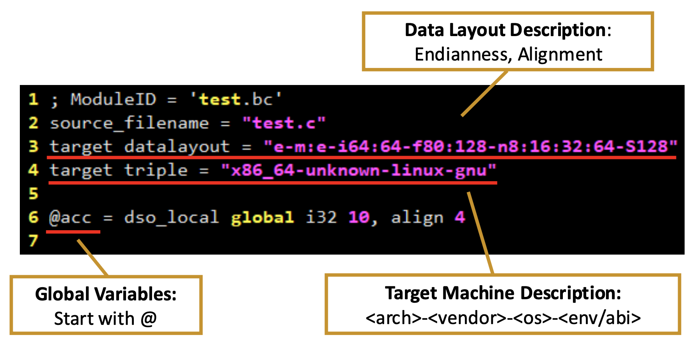
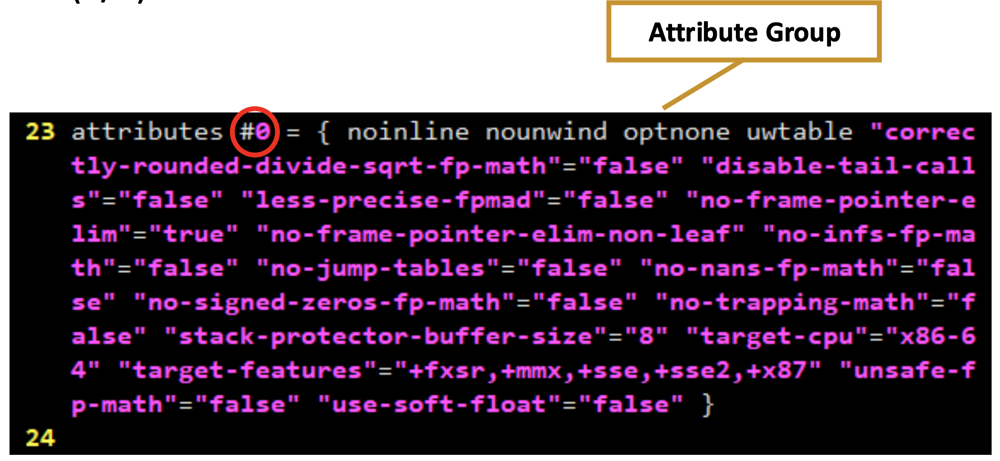
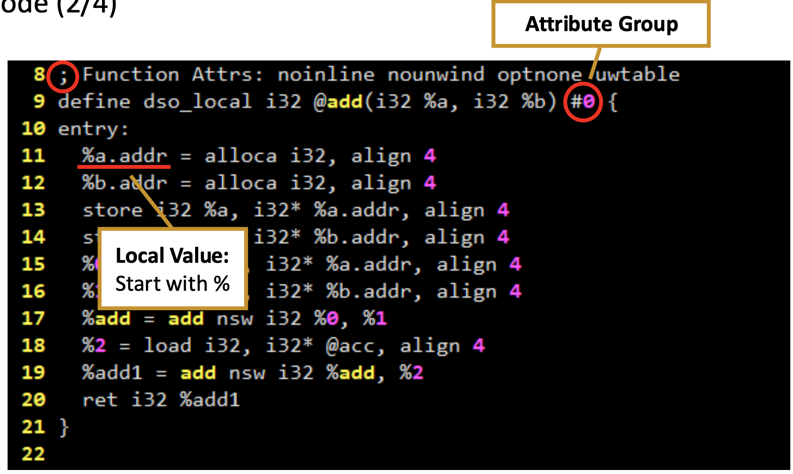
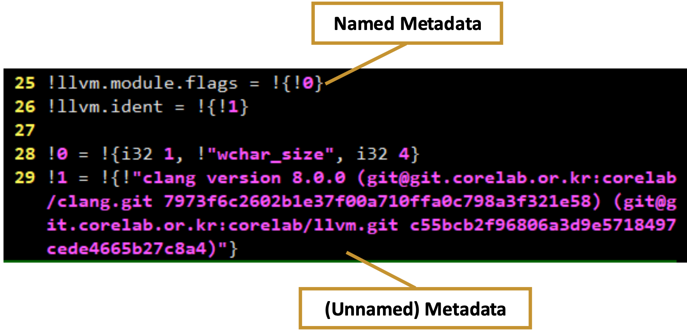

# Control Flow Graph

## Notion
### LLVM IR Features
1. Strongly typed
  - 암시적 타입 캐스팅을 허용하지 않고, 명시적으로만 \
  ex) i32 -> signed 32-bit integer
2. Single Static Assignment (SSA)
  - 값의 재정의 없음 \
  ex1) %y = %x + 1 <br> 
       %x = %x +1 (X)
    - 퍼센트 기호(%)로 시작하는 이름은 SSA 형태의 가상 레지스터 또는 로컬 변수
    - <b>실제 CPU 레지스터에 직접 매핑되지 않으며, 각 연산의 결과는 새로운 %로 시작하는 이름으로 할당</b>
  ex2) $0가 아니라 %add\
    - $는 IR이후 단계에서 물리적 레지스터 나타내는 경우가 많음

  -  프로그램 분석을 용이하게 한다 \
    a. Liveness Analysis
      - 변수가 더 이상 사용되지 않는 시점을 파악하여 메모리나 레지스터를 효율적으로 할당하는 데 사용
      - <b style="color:red;">SSA 형태는 각 변수 정의가 고유하기 때문에, 이 'DEF'와 'USE'의 관계를 추적하기가 훨씬 쉬워짐</b>

    b. Constant Propagation
      - x가 10으로 정의되었다면, y = x + 5라는 코드에서 x 대신 직접 10을 대입하여 y = 10 + 5 으로 최적화
      - <b style="color:red;">SSA는 각 변수 정의가 고유하고 명확하므로, 특정 변수가 상수 값을 가지는지 여부를 쉽게 추적</b>

  - Phi(Φ) Node \
    분기를 위해 필요
    - 실행 흐름이 여러 경로로 나뉘었다가 다시 한 지점으로 합쳐질 때, 이 합쳐지는 지점에서 Φ 노드가 사용
    - Φ 노드는 어떤 경로를 통해 현재 지점에 도달했는지에 따라 올바른 SSA 변수(즉, 올바른 값)를 "선택"하여 새로운 SSA 변수(예: x3)를 정의
    - 이전 기본 블록마다 Φ 노드가 "선택해야 할" 변수의 정의가 다를 수 있기 때문에 이전 basic block 기억 필요
    
### LLVM IR: Type system 
1. Integer Type <br> 
  ```iN```: N-bit integer type
2. Floating-point Types <br>
  half (16-bit), float (32-bit), double (64-bit), fp128 (128-bit)
3. Pointer Type <br>
  ```<type> *```
  ex) [4 x i32] * : 4개의 32비트 정수(i32)로 구성된 배열 타입
4.  Vector Type <br>
  ```< <# of elements> x <element type> >```
  ex) <4 x i32>, <8 x float>
5. Array Type <br>
  ```[<# of elements> x <element type>]```
  ex) [3 x [4 x i32]]
6. Structure Type <br>
  ▪ Normal struct type: ```$T1 = type { <type list> }``` \
  ▪ Packed struct type: ```$T2 = type <{ <type list>}>```
  ex) { i32, i32, i32 }, <{ i8, i32 }>
7. Function Type <br>
  ```<return type> (<parameter list>)``` \
  ex) float (i16, i32*) * (의미 = float (*)(short, int*), 특정 함수를 가리키는 포인터)

### LLVM IR: Instructions
1. Binary Operations
    - 정수연산 : add, sub
    - 실수연산: fadd, fsub \
      ex) ```%result = fadd float %x, %y ```
2. Memory Access and Addressing Operations
    - allca: stack frame의 메모리에 할당 \
      ex) ```%ptr = alloca i32```
    - load, store
    - getelementptr
      - 구조체나 배열 같은 집합 데이터 구조(aggregate data structure) 내부 요소의 주소를 계산
      - **기준점(베이스 포인터)** 으로부터 얼마나 떨어져 있는 곳의 주소를 알고 싶냐를 계산
      - 주소 계산만 수행하는 매우 가벼운 명령
      - 포인터 역참조
        - <span style="color:red;">GEP는 포인터가 가리키는 주소로부터의 상대 주소를 계산할 뿐, 해당 주소의 값을 읽어오지는 않습니다. </span> 
      - Structure member 접근 \
      ex) ```%iptr = getelementptr [10 x i32], [10 x i32]* @arr, i16 0, i16 0```
          - [10 x i32]: 주소를 계산할 때 기준
          - [10 x i32]* @arr:
              - 두 번째 인수는 항상 포인터 또는 포인터 벡터이며 시작할 기본 주소
              - @arr라는 변수가 가리키는 곳부터 주소 계산을 시작할 건데, @arr는 10개짜리 i32 배열의 주소를 가지고 있다는 의미
              - @arr: 전역변수 array
          - 첫 번째 인덱스 (i16 0): 
              - 베이스 포인터([10 x i32]* @arr)가 가리키는 전체 배열 중 몇 번째 배열인지. 
              - @arr는 단일 배열로 0을 사용
              - 만약 @arr가 배열의 배열(예: [2 x [10 x i32]])이었다면 첫 번째 0은 첫 번째 [10 x i32] 배열을, 1은 두 번째 [10 x i32] 배열
          - 두 번째 인덱스 (i16 0): 
              - 첫 번째 인덱스에서 선택된 배열([10 x i32]) 내에서 몇 번째 요소인가
              - [10 x i32] 배열의 0번째 i32 요소를 선택합니다.

          ```
            int arr[10]; // LLVM의 @arr에 해당

            // %iptr = getelementptr [10 x i32], [10 x i32]* @arr, i16 0, i16 0
            int* iptr = &arr[0]; // 또는 int* iptr = arr; 와 동일한 결과를 냅니다.
          ```
3. Terminator Instructions
    - LLVM Basic Block의 마지막에 반드시 위치해야 하는 명령어
      - **ret** : 함수에서 제어 흐름을 반환 \
          ex) ret i32 5 Return an integer value of 5
      - **br** : 다른 basic block으로 control flow를 이동
          ex) br i1(1byte int, cond의 타입) %cond, label %IfEqual, label %IfUnequal
      - **invoke** : 제어를 지정된 함수로 전달 (exception handling)
          - 함수 호출 중 예외가 발생할 가능성이 있을 때 사용 \
          ex) ```%retval = invoke i32 @Test(i32 15) to label %Continue unwind label %TestCleanup``` \
            -  Test 함수 호출 정상이면 Continue label로 예로 시 TestCleanup으로


4. Other operations
    - icmp: compare two integer
    - call: Call a function
    - phi: Implement Φ node
        - Φ node: ..?

### LLVM IR: Module


- Global Variables: Start with @
- Data Layout Description: Endianness, Alignment
    - 데이터 레이아웃(Data Layout) 정보를 정의
    - 해당 모듈이 어떤 타겟 아키텍처에서 실행될 것인지에 대한 상세한 메모리 배치 규칙을 명시
    - endianness: 바이트 순서(e는 little-endian)
    - alignment: 정수/부동 소수점 타입의 정렬
- Target Machine Description: ```<arch>-<vendor>-<os>-<env/abi>```
    - LLVM이 이 코드를 생성할 대상 시스템을 명확히 식별하는 표준화된 문자열
<br><br>




- Local Value: Start with %
- Attribute Group: 여러 개의 속성(Attributes)을 묶어놓은 집합입니다. 이 그룹은 고유한 숫자로 식별
  - **속성(Attributes)**은 LLVM 컴파일러에게 특정 함수, 매개변수, 또는 반환 값의 동작이나 특성에 대한 추가적인 정보나 힌트를 제공하는 메타데이터



- !{!0}: 이 명명된 메타데이터가 익명 메타데이터 노드 !0을 참조하고 있음을 나타냅니다. 중괄호 {} 안에 들어간다는 것은 메타데이터 노드들의 "배열" 또는 "목록"을 의미

- 실제 메타데이터 값들은 익명 메타데이터 노드에 저장
    - 이 노드들은 ! 다음에 숫자가 붙는 형태

### How to Visualize LLVM IR Code
- LLVM이 제공하는 Built-in Printer Passes
  - opt 도구(LLVM 최적화 패스 드라이버)는 다양한 분석 결과를 그래프 형태로 출력할 수 있는 "프린터 패스"를 내장 \
    ▪ Control Flow Graph (CFG) \
      ```opt -dot-cfg```
    ▪ Call Graph \
      ```opt -dot-callgraph```
    ▪ Dominance Tree 
      ```opt -dot-dom```

## Each Step Command
1. Write a simple matrix multiplication function (mm.c)
2. Generate mm.bc from mm.c \
    ``` clang -O1 -c -emit-llvm --sysroot=`xcrun --show-sdk-path` mm.c -o mm.bc ```
3. Apply the CFG printer pass to mm.bc
      ~~~ 
        opt -passes=dot-cfg mm.bc
        opt -passes=dot-cfg mm.bc -o /dev/null
        # opt -passes=dot-cfg mm.bc -o cfg.main.dot (이건 불가능, 제대로 인코딩이 안 됨)
      ~~~
    - 결과 출력
      ```Writing '.main.dot'...```
4. Convert the dot file to a pdf file \
    - ```brew install graphviz``` -> dot 쓰기 위해 사용 \
    ```dot -Tpdf .main.dot -o cfg.main.pdf```
5. Check the pdf file

## results
cfg.main.pdf 확인

## Further
- recognizing a loop in the control flow graph
