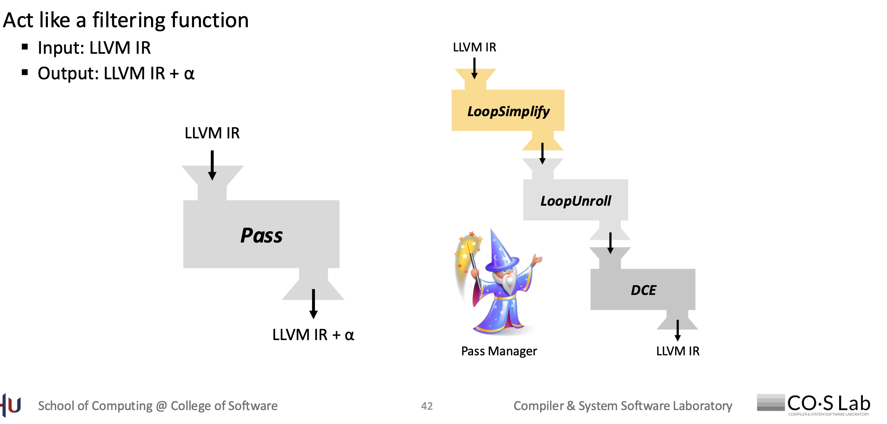

# First LLVM Pass

## Notion1
### IR Manipulation
#### objects
    - Module object
        -  GlobalVariable object
        -  Function object
            - BasicBlock object
#### class Module
- LLVM IR 계층 구조의 가장 최상위 컨테이너
- 모든 함수 (llvm::Function), 전역 변수 (llvm::GlobalVariable), 외부에 선언된 함수 (Function 선언), 타입 정의, 메타데이터 (NamedMDNode, MDNode) 등이 모두 이 Module 내에 포함
- 
#### class Function
- llvm::Module 내부에 정의되거나 선언된 단일 함수
- 고수준 언어의 함수(예: C/C++ 함수)와 직접적으로 매핑
- llvm::BasicBlock 객체들의 리스트로 구성
- 반환 타입: getReturnType() 메서드로 함수가 반환하는 값의 타입 얻음
- 함수 타입: getFunctionType() 메서드로 함수의 반환 타입과 모든 인자 타입을 포함하는 FunctionType 객체를 얻음

### LLVM IR: Types
- LLVM IR is strongly typed
- 타입 인스턴스를 얻는 방법
        - LLVM maintains IR types as static C++ objects
- How to get Type instances
    - Use static member functions of class Type
        - llvm::Type 클래스의 **정적 팩토리 메서드(static factory methods)**를 통해 특정 타입의 유일한 인스턴스를 얻음
        - 이는 LLVM이 모든 타입을 uniqu한한 스태틱(static) C++ 객체로 유지하기 때문이다. \
        ex) ```static IntegerType * getInt1Ty(LLVMContext &C)```: 1비트 정수 타입 (i1, 불리언)
- How to check Type instances 
    ex) bool isHalfTy() const: 해당 타입이 16비트 부동 소수점(half-precision float)인지 확인
- Get the point type of a type
    - Type::getInt32Ty(Context)->getPointerTo()는 i32* 타입을 나타내는 PointerType 객체를 반환


## Notion2: IR Optimization - Analysis
### IR Optimization

LLVM pass framework를 통해 modular optimizations이 가능하다. \
**"pass"** 란? Unit of optimization \
- 루프 최적화, 불필요한 코드 제거, 레지스터 할당 등 각각의 작업이 하나의 패스로 구현 

각 LLVM pass는 LLVM IR에 대한 최적화 및 변환을 수행
-  LLVM 패스들은 LLVM IR 코드를 입력으로 받아, 해당 IR을 분석하거나 변경(변환)하여 더 효율적인 IR 코드를 생성

### LLVM Pass: Concept


**pass** 는 필터링 함수처럼 작동
- Input: 모든 LLVM 패스는 LLVM IR (Intermediate Representation) 코드를 입력으로 받음
- Output: LLVM IR을 분석하거나 변형하여 새로운 LLVM IR을 출력 \
    - LLVM IR -> Pass -> LLVM IR + α
    - => LLVM IR -> LoopSimplify -> LoopUnroll -> DCE -> Pass Manager -> LLVM IR
        - LoopSimplify: 루프의 구조를 표준화하고 단순화하는 역할을 하는 패스
        - LoopUnroll: 루프 본문을 여러 번 복제하여 루프의 반복 횟수를 줄이는 역할을 하는 패스
        - Dead Code Elimination (DCE): 프로그램 결과에 영향을 미치지 않는 불필요한 코드를 제거하는 역할을 하는 패스
        - 이 패스들은 LLVM의 패스 프레임워크 위에서 동작
- **pass Manager**
    - LLVM에서 pass들의 실행을 관리하고 조율하는 핵심 컴포넌트
    - 개발자가 직접 패스들을 하나하나 호출하는 대신, Pass Manager에 원하는 패스들을 등록하고 실행을 지시하면, Pass Manager가 등록된 순서대로 패스들을 호출하며 IR을 넘겨준다.
    - Pass Manager는 pass 간의 종속성을 관리하거나, 특정 pass가 IR을 변경했을 때 다음 pass가 변경된 IR을 받도록 하는 등의 역할을 수행합니다. 
    - 또한, 패스가 어떤 종류의 정보를 필요로 하는지(예: LoopInfo, DominatorTree)를 관리하고 필요한 분석 패스를 자동으로 실행하기도 한다.
    - Pass Manager는 여러 패스를 하나의 최적화 파이프라인으로 묶어 효율적으로 실행할 수 있도록 돕는다.

### LLVM Pass: Implementation 
LLVM의 "PassInfoMixin" 클래스를 상속하는 C++ 클래스
- LLVM에서 새로운 pass를 C++로 구현하려면, 특정 기본 클래스나 믹스인(mixin) 클래스를 상속받아야 하며  ***LLVM 버전에서는 PassInfoMixin 클래스를 상속받는 것이 일반적***이다.
    - PassInfoMixin: 이 믹스인은 패스의 메타데이터(예: 이름, ID)를 관리하는 데 사용

- Dynamically Loaded at Run-time (런타임에 동적으로 로드)
    - LLVM은 구현된 패스를 정적으로 컴파일러에 링크하는 대신, 런타임에 동적으로 로드할 수 있는 기능 제공 
    - 플러그인(plugin) 방식으로 패스를 추가할 수 있게 해줌

    ex) ```opt -load-pass-plugin ~/lib/MyPass.so -passes=MyPass test.bc -o test.opt.bc```

    - ***-load-pass-plugin ~/lib/MyPass.so***: opt에게 특정 경로(~/lib/MyPass.so)에 있는 공유 라이브러리(또는 DLL) 파일을 로드하라고 지시, 공유 라이브러리 안에 사용자가 구현한 패스 코드가 들어 있습니다.
    - ***passes=MyPass***: 로드된 라이브러리 내에서 MyPass라는 이름의 패스를 찾아서 실행 지시.
    - ***test.bc***: 최적화를 적용할 입력 비트코드 파일

### Skeleton Code: ModulePass
#### header
~~~
#include "llvm/IR/Function.h"    // Function 클래스 사용을 위해 필요
#include "llvm/IR/PassManager.h" // PreservedAnalyses, ModuleAnalysisManager 등을 위해 필요
#include "llvm/Pass.h"           // 구 Pass Manager 관련 (현재는 주로 PassInfoMixin 사용)

using namespace llvm;

// PassInfoMixin을 상속하는 struct/class 정의
// <HelloModule>은 CRTP (Curiously Recurring Template Pattern: 클래스가 자신을 템플릿 인수로 사용)
struct HelloModule : public PassInfoMixin<HelloModule> {
public:
    // Pass의 핵심 로직을 담는 run 메서드
    // ModulePass의 run 메서드는 Module &M을 인자로 받습니다.
    static PreservedAnalyses run(Module &M, ModuleAnalysisManager &MAM);
}
~~~
- PreservedAnalyses: 패스가 실행된 후에도 여전히 유효한 분석 정보(Analysis)를 Pass Manager에게 알려주는 반환 타입
    - 만약 패스가 IR을 변경하여 어떤 분석 정보가 무효화되었다면, 이를 PreservedAnalyses::none() 등으로 반환하여 Pass Manager가 해당 분석 정보를 다시 계산하도록 유도
    - LLVM IR을 변경하지 않았으므로, 이전에 계산된 모든 분석 정보가 여전히 유효 시, PreservedAnalyses::all()

- Module &M: 이 패스가 동작할 대상 Module 객체
    - ModulePass이므로 Module을 인자로 받는다. FunctionPass였다면 Function &F를 받는다.

- ModuleAnalysisManager &MAM: Pass Manager가 관리하는 분석 정보를 얻을 수 있는 객체
    -  예를 들어, MAM.getResult<DominatorTreeAnalysis>(M)를 통해 특정 함수의 지배 트리 정보를 얻을 수 있다

#### source code
- run 메서드의 실제 구현이 들어가는 파일
~~~
#include "HelloModule/HelloModule.h" // 정의한 헤더 파일 포함

PreservedAnalyses HelloModule::run(const Module &M, ModuleAnalysisManager &MAM) {
    // 코드를 분석하거나 최적화하는 작업을 수행
    // run 메서드 내에 이 패스가 실제로 수행할 로직을 작성
    // Module &M을 통해 대상 모듈의 모든 함수, 전역 변수 등에 접근하고 조작 가능
    // 일반적인 패턴은 모듈 내의 모든 함수를 순회하고, 각 함수 내의 모든 기본 블록을 순회하고, 각 기본 블록 내의 모든 명령어를 순회하며 원하는 작업을 수행

    return PreservedAnalyses::all(); // 여기서는 예시로 아무것도 변경하지 않아 모두 IR 분석 보존한다고 가정
}
~~~

- LVM이 패스를 동적으로 로드할 수 있도록 패스를 **등록(Register)**하는 코드
~~~
extern "C" LLVM_PLUGIN_API_EXPORT
llvm::PassPluginInfo llvmGetPassPluginInfo() {
  return {
      LLVM_PLUGIN_API_VERSION,           // 플러그인 API 버전
      "HelloModulePlugin",               // 플러그인 이름 (내부 식별자)
      LLVM_VERSION_STRING,               // LLVM 버전 문자열
      [](PassBuilder &PB) {
        // PassBuilder에 PassParserCallback을 등록
        PB.registerPipelineParsingCallback(
            [](llvm::StringRef name, llvm::ModulePassManager &MPM,
               llvm::ArrayRef<llvm::PassBuilder::PipelineElement>) {
              // "hello-module"이라는 이름으로 패스가 요청되면
              if (name == "hello-module") { // <-- Pass name (패스 이름)
                MPM.addPass(HelloModule()); // HelloModule 패스를 파이프라인에 추가
                return true;
              }
              return false;
            });
      }};
}
~~~
- extern "C" LLVM_PLUGIN_API_EXPORT llvm::PassPluginInfo llvmGetPassPluginInfo(): \
    - 이 함수는 LLVM 플러그인의 **진입점(entry point)**
    - LLVM이 동적 라이브러리(MyPass.so)를 로드할 때 이 함수를 찾아서 호출
    
    - LLVM_PLUGIN_API_EXPORT: 플러그인 심볼을 내보내는 매크로입니다.
    - PassPluginInfo 객체 반환: 이 함수는 PassPluginInfo 구조체를 반환
        - 이 구조체는 플러그인 버전, 이름, 그리고 가장 중요한 **패스 등록 콜백(callback)**을 포함

- PB.registerPipelineParsingCallback(...):
    - PassBuilder (PB)는 LLVM 최적화 파이프라인을 구축하는 데 사용되는 클래스
    - <span stype="color:red;">이 콜백 함수는 사용자가 opt -passes=...와 같이 패스 파이프라인을 지정했을 때, LLVM이 해당 문자열을 파싱하는 도중 사용자 정의 패스 이름("hello-module")을 만나면 호출</span>
- if (name == "hello-module"): 사용자가 opt -passes=hello-module이라고 입력하면 이 조건이 참이 된다.

- MPM.addPass(HelloModule()): 이 부분에서 HelloModule 패스의 인스턴스를 생성하여 ModulePassManager(MPM)에 추가한다. 이렇게 패스가 파이프라인에 주입된다.

#### 전체적인 흐름
패스 정의: HelloModule.h에서 PassInfoMixin을 상속받는 HelloModule 클래스를 선언하고 run 메서드를 선언합니다. \
패스 구현: HelloModule.cpp에서 run 메서드의 본문을 구현하여 실제 최적화/분석 로직을 작성합니다. \
패스 등록: 같은 HelloModule.cpp 또는 별도의 파일에서 llvmGetPassPluginInfo() 함수를 구현하여 PassBuilder에 hello-module이라는 이름으로 HelloModule 패스를 등록합니다. \
컴파일: 이 C++ 파일을 공유 라이브러리(예: MyPass.so)로 컴파일합니다. \
실행: opt 명령어를 사용하여 이 공유 라이브러리를 로드하고 패스를 실행합니다. (pass가 모듈 단위니까 모듈 단위로 최적화) \
opt -load-pass-plugin /path/to/MyPass.so -passes=hello-module input.bc -o output.bc

### Skeleton Code: FunctionPass <차이점만>
- FunctionAnalysisManager &FAM 를 사용하고 Function을 넘김
- const llvm::Function &F: 인자를 함수로 넘긴다

### How to Run LLVM Pass
1. Compile LLVM Passes <br>
    ```$ clang++ -c -fpic -fno-rtti -stdlib=libc++ `llvm-config --cppflags` HelloModule.cpp -o HelloModule.o``` \
    Automatically generate compile options
2. Make a shared library with the LLVM passes <br>
    ```$ clang++ -shared HelloModule.o -o HelloModule.so```
3. Run the LLVM Passes using opt <br>
    ```$ opt –load-pass-plugin HelloModule.so –passes=hello-module test.bc –o test.opt.bc```

## Each Step Command
1) Open “lib/FunctionNamePrinter/FunctionNamePrinter.cpp” <br>
2) Print the names of function in the run function <br>
    ▪ To print a debug message with function name <br>
    ▪ ```#include “llvm/Support/Debug.h”``` <br>
    ▪ ```dbgs() << "[FunctionNamePrinter] F.getName()\n";``` <br>
3) Compile and test the pass <br>
    a. compile <br>
        ```clang++ -c -fpic -fno-rtti -stdlib=libc++ `llvm-config --cppflags` FunctionNamePrinter.cpp -o FunctionNamePrinter.o --sysroot=`xcrun --show-sdk-path``` <br>
        <br>

    b. Make a shared library with the LLVM passes <br>
    
            ~~~
                clang++ -shared FunctionNamePrinter.o -o FunctionNamePrinter.so \
                --sysroot=$(xcrun --show-sdk-path) \
                $(llvm-config --ldflags --libs) \
                -lc++ -lc++abi -lunwind
            ~~~
   
    c. Run the LLVM Passes using opt <br>
        ```opt --load-pass-plugin FunctionNamePrinter.so --passes=function-name-printer ../../exercise1/test.bc -o    ../../exercise3/test.opt.bc``` <br>
        
        - result message <br>
            ~~~
                [Plugin] Registering FunctionNamePrinter Pass
                [FunctionNamePrinter] add
                [FunctionNamePrinter] main
            ~~~
### option
| 옵션 | 설명 | 
| :--- | :--- | 
| **`-fpic`** | **PIC (Position-Independent Code) 생성**<br>코드를 메모리의 어떤 위치에 로드해도 실행될 수 있게 만드는 옵션임. 주로 동적 라이브러리(`.so`, `.dll`) 빌드 시 필수 사항. |
| **`-fno-rtti`** | **RTTI (Run-Time Type Information) 비활성화**<br>런타임 시 객체 타입 정보를 사용하지 않도록 함. 코드 크기를 줄일 수 있으나, `dynamic_cast`나 `typeid` 사용 불가. |
| **`-stdlib=libc++`** | **표준 라이브러리 지정**<br>C++ 표준 라이브러리로 Clang의 자체 구현체인 **`libc++`**를 사용함. GCC의 `libstdc++`와는 다른 라이브러리. |
| **``llvm-config --cppflags```** | **LLVM 컴파일 플래그 가져오기**<br>명령어를 실행하여 LLVM 헤더 파일 경로 등 필요한 컴파일 플래그를 자동으로 추가해주는 기능. 편리한 빌드를 위한 지원. |

- `clang++` shared lib option 
    | 옵션 | 설명 |
    | :--- | :--- |
    | **`$(llvm-config --ldflags --libs)`** | **LLVM 링크 옵션 가져오기**<br>LLVM 라이브러리와 프로그램을 링크하는 데 필요한 모든 플래그를 자동으로 가져오는 명령어임. `--ldflags`는 링크 시 필요한 경로를, `--libs`는 실제 링크할 라이브러리 목록을 출력함. |
    | **`-lc++`, `-lc++abi`, `-lunwind`** | **표준 라이브러리 및 런타임 링크**<br><ul><li>**`-lc++`**: Clang의 C++ 표준 라이브러리인 `libc++`를 링크함.</li><li>**`-lc++abi`**: `libc++`에 필요한 ABI(Application Binary Interface) 라이브러리를 링크함.</li><li>**`-lunwind`**: 스택 언와인딩(Stack Unwinding)을 처리하는 라이브러리를 링크함. 예외 처리 등에서 사용됨.</li></ul>|

- `opt` option 
    | 옵션 | 설명 |
    | :--- | :--- |
    | **`--load-pass-plugin`** | **사용자 정의 패스 플러그인 로드**<br>`opt` 툴 실행 시, 직접 만든 패스가 포함된 동적 라이브러리(`.so` 파일)를 로드하는 옵션임. 이 옵션을 사용해 커스텀 패스를 LLVM 툴에 등록하고 실행할 수 있음. |

## results
``` llvm-dis test.opt.bc ``` 
- exercise3 와 exercise1의 C0는 다름, C0보다 최적화됨
- exercise3 와 exercise1의 C1 이상과 동일

#### C 컴파일러 최적화 레벨과 LLVM 패스 비교

| 특징         | C 컴파일러 최적화 레벨 (`-O1`, `-O2`, `-O3`)                 | LLVM 패스 (개별 Pass)                                  |
| :----------- | :----------------------------------------------------------- | :----------------------------------------------------- |
| **개념** | 미리 정의된 **여러 패스들의 집합** | **단일하고 구체적인** 분석 또는 변환 모듈              |
| **목적** | 고수준의 성능/코드 크기 최적화 목표 달성                     | 특정 IR 분석/변환 작업 수행                            |
| **사용** | 컴파일러 플래그로 간단하게 지정                              | `opt` 도구를 통해 명시적으로 지정 또는 조합            |
| **세분성** | 큰 묶음 단위                                                 | 아주 세밀한 단위                                       |
| **커스터마이징** | 제한적 (이미 정의된 묶음 사용)                               | 매우 유연 (원하는 패스 조합, 새로운 패스 작성 가능)      |
| **예시** | `clang -O2 hello.c -o hello`                                 | `opt -instcombine -loop-unroll hello.ll -S -o optimized.ll` |
| **주 사용자** | 일반 개발자                                                  | 컴파일러 개발자, 연구자, 고급 최적화 전문가          |

---


