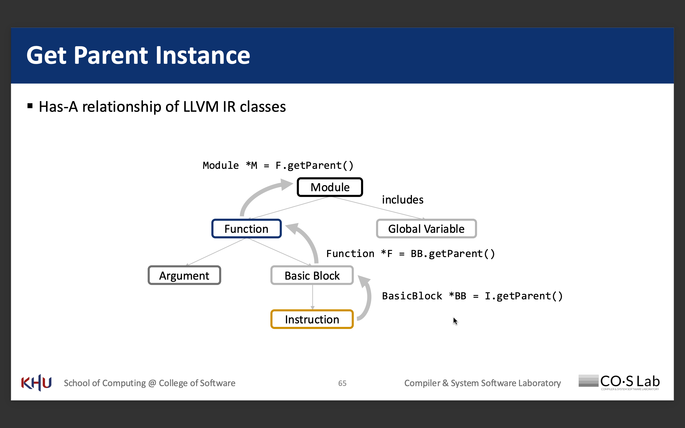

# (Static) Instruction Count 

## Notion
### IR Code Analysis

### Useful Basic Iterators
#### class Module
- FunctionListType::iterator 및 FunctionListType::const_iterator를 각각 iterator 및 const_iterator 타입으로 정의.
- 이는 Module 내의 Function 객체들을 직접 반복할 수 있다는 의미
- 함수들에 대한 반복자를 얻기 위한 begin() 및 end() 메서드를 제공
- module --include--> function

#### class Function
- BasicBlockListType::iterator 및 BasicBlockListType::const_iterator를 각각 iterator 및 const_iterator 타입으로 정의
- Function 내의 BasicBlock 객체들을 직접 반복할 수 있다는 의미
- function --include--> basic block \
ex) Module 내의 Function 객체들을 반복하는 구체적인 코드 예제
~~~
for(Function &F : M) {
    // to do sth with F
}

Module::iterator Begin = M.begin();
Module::iterator End = M.end();
for (Module::iterator it = Begin; it != End; ++it) {
    Function &F = *it;
    // to do sth with F
}
~~~

#### class BasicBlock
- InstListType::iterator 및 InstListType::const_iterator를 각각 iterator 및 const_iterator 타입으로 정의
- BasicBlock 내의 Instruction 객체들을 직접 반복할 수 있다는 의미
- basic block --include--> instruction \
ex)
~~~
for(Function &F : M) {          // 모듈 M 내의 각 함수 F를 반복한다
    for(BasicBlock &BB : F) {    // 함수 F 내의 각 기본 블록 BB를 반복한다
        for(Instruction &I : BB) { // 기본 블록 BB 내의 각 명령 I를 반복한다
            // to do sth with I
        }
    }
}
~~~

#### other
https://llvm.org/doxygen/classllvm_1_1Module.html
- Module 내의 전역 변수
    - GlobalListType::iterator와 GlobalListType::const_iterator를 각각 global_iterator 및 const_global_iterator 타입으로 정의
    - 이는 Module 내의 GlobalVariable 객체들을 직접 반복할 수 있다는 의미
    - 전역 변수들을 위한 반복자를 얻기 위한 global_begin() 및 global_end() 메서드를 제공
    - global_empty(): const { return GlobalList.empty(); }
    - 변경 가능한 반복자와 상수 반복자 모두를 위한 iterator_range를 반환하는 globals() 메서드도 제공한다는 점입니다. 이는 (이후 예제에서 보여지듯이) 범위 기반 for 루프를 직접 사용하는 데 편리하게 활용됩니다.
    - Module --include--> GlobalVariable

- Function class 내의 함수 인자 반복
    -  arg_iterator와 const_arg_iterator 타입을 각각 단순히 Argument* 및 const Argument*로 정의
    - 인자들이 일반적으로 연속적인 메모리 블록이나 포인터 목록으로 관리됨
    - 함수 인자들의 시작과 끝을 가리키는 반복자(포인터)를 얻기 위한 arg_begin() 및 arg_end() 메서드를 제공
    - 인자들을 위한 iterator_range를 반환하는 args() 메서드를 제공하여 범위 기반 for 루프에 이용 가능.
    - Function --includes--> Argument
ex)
이 슬라이드는 Function (여기서는 F로 표현)의 Argument 객체들을 반복하는 구체적인 코드 예제를 제공합니다.

F.args()를 사용한 for-each 문 (C++11 범위 기반 for 루프):

C++
~~~
for(Argument *Arg : F.args()) {
    
}
~~~

~~~
Function::arg_iterator Begin = F.arg_begin();
Function::arg_iterator End = F.arg_end();
for (Function::arg_iterator it = Begin; it != End; ++it) {
    Argument *Arg = *it;
    // do sth with Arg
}
~~~

### Get Parent Instance


## Each Step Command
1) Open “lib/InstCount/InstCount.cpp”
2) Modify the run function to
    ▪ Count the number of instructions in a function
    ▪ Print the function name and the number of instructions
    ~~~
    for (BasicBlock &BB : F) {
        dbgs() << "[InstCount] " << F.getName() << " [# of Instructions] "<< B.size()<<"\n";
    }
    ~~~
3) Compile and test the pass
    a. compile
    ```clang++ -c -fpic -fno-rtti -stdlib=libc++ `llvm-config --cppflags` InstCount.cpp -o InstCount.o --sysroot=`xcrun --show-sdk-path```
    b.  Make a shared library with the LLVM passes
        ~~~
        clang++ -shared InstCount.o -o InstCount.so \
            --sysroot=$(xcrun --show-sdk-path) \
            $(llvm-config --ldflags --libs) \
            -lc++abi -lunwind
        ~~~
    c. Run the LLVM Passes
    ```opt --load-pass-plugin InstCount.so --passes=inst-count ../../exercise1/test.bc -o ../../exercise4/test.opt.bc```
    - result message
    ~~~
    [Plugin] Registering InstCount Pass
    [InstCount] add [# of Instructions] 2
    [InstCount] main [# of Instructions] 2
    ~~~

## results
~~~
define i32 @add(i32 noundef %0, i32 noundef %1) local_unnamed_addr #0 {
  %3 = add nsw i32 %1, %0 -> 1
  ret i32 %3 -> 2
}
~~~
=> 따라서 instruction 2개

~~~
define noundef i32 @main() local_unnamed_addr #1 {
  %1 = tail call i32 (ptr, ...) @printf(ptr noundef nonnull dereferenceable(1) @.str, i32 noundef 5) -> 1
  ret i32 0 -> 2
}
~~~
=> 따라서 instruction 2개

## etc.
LLVM 패스의 두 가지 타입:
- Analysis Pass (분석 패스): IR을 읽기만 하고 수정하지 않습니다. 이런 패스에서는 const 참조를 사용하는 것이 일반적입니다.
- Transform Pass (변환 패스): IR을 수정합니다. 이런 패스에서는 const가 없는 참조를 사용하여 IR 객체를 변경할 수 있어야 합니다.

