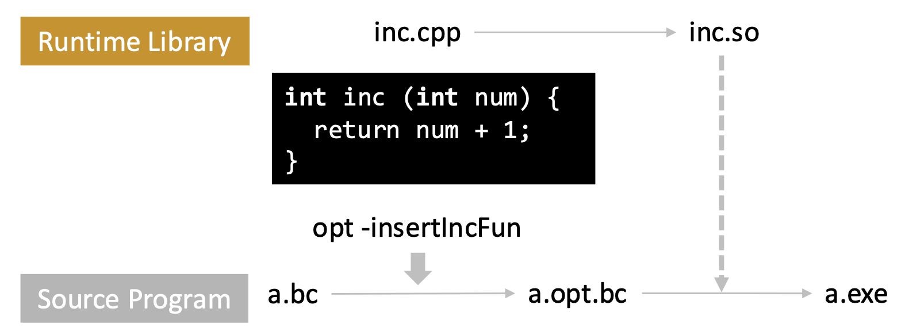

# Insert a New Function

## Notion
### How to Instrument Runtime Function Call
- LLVM IR로 함수를 구현하는 것은 시간이 많이 걸린다.
- ***함수를 C/C++로 구현한 다음 라이브러리로 링크하는 것이 좋다*** \


**Step**
1. C/C++로 런타임 함수 작성:
- extern "C"를 사용하여 C++ 함수의 name mangling을 피한다.
    - 이름 맹글링: C++ 컴파일러가 오버로딩 지원을 위해 함수 이름에 추가 정보를 붙여서 내부적인 이름을 만드는 과정입니다. original_name_0x12 이런식으로
    - extern "C": C++ 컴파일러에게 "이 함수는 C++ 규칙 말고, C 규칙(이름 맹글링 없음)에 따라 이름을 만들어라"라고 지시하는 키워드
    -  LLVM IR이나 C 언어처럼 이름 맹글링을 이해하지 못하는 다른 시스템과 C++ 코드를 연동할 때, 함수의 이름을 예측 가능하게(원본 이름 그대로) 유지하여 서로 올바르게 함수를 찾고 연

2. Pass 내에서 getOrInsertFunction을 사용하여 런타임 함수에 대한 Function 객체 생성:
* LLVM IR에서의 함수 이름과 타입은 일치해야 한다.
* LLVM IR 내에서 이 Function 객체는 단지 선언만 되어 있는 상태다. 실제 함수 본문은 C/C++ 라이브러리에 있으므로, LLVM IR 내부에서 이 함수에 대한 BasicBlock이나 명령어를 생성할 필요가 없다. 이는 마치 C/C++에서 extern 선언을 통해 다른 파일에 정의된 함수를 사용하는 것과 같다.
    * 즉, getOrInsertFunction으로 만드는 Function 객체는 "이런 이름과 이런 시그니처를 가진 함수가 어딘가에 있다"라고 선언만(빈 틀) 하는 것이다. 실제 함수가 어떤 일을 하는지 (즉, 내부의 BasicBlock이나 명령어들)에 대한 정보는 이 Function 객체 안에 들어있지 않다.
    * 나중에 최종 프로그램을 만들 때, 링커가 그 약속에 맞는 실제 함수(C/C++ 라이브러리의 구현체)를 찾아서 연결해 줄 것이기 때문이다.

3. Link the runtime function
- 컴파일러가 최종 실행 파일을 생성할 때, 런타임 함수가 포함된 라이브러리(inc.so 같은)를 링크하도록 지시

## Load Tracer
* Goal:프로그램 내의 모든 load 명령어를 추적
    * 모든 load 명령어 앞에 런타임 함수를 삽입해야 한다.
    * 즉, load 명령어가 실행되기 직전에 traceLoadInstr 함수를 호출하여 해당 load 명령어가 어떤 주소에서 어떤 값을 읽을지 추적하는 것이 목표
* Runtime Function:
    * void traceLoadInstr(void *addr, InstID instID)
        * *addr: 로드 명령어에서 메모리에 접근하는 주소 (pointer to void).
        * InstID instID: 로드 명령어의 고유 ID (정수).
    * 로드 명령어의 주소와 명령어 ID를 기록
* example
    ```C++
    extern "C"
    void traceLoadInstr(void *addr, InstID instID) {
        // Do something (e.g., print to console, write to a log file, store in memory)
        // 실제 로직은 여기에 구현됩니다.
    }
    ```

    ```C++
    traceLoadInstr = M.getOrInsertFunction(
    "traceLoadInstr",               // Function Name
    Type::getVoidTy(Context),       // Return Type (void)
    Type::getInt64Ty(Context),      // Argument Type 1: Address (void*)
    Type::getInt64Ty(Context)       // Argument Type 2: Instruction ID
    );

    if (LoadInst *Load = dyn_cast<LoadInst>(&I)) { // I는 현재 BasicBlock을 순회하며 얻은 Instruction* (명령어)
        // Some Code
        actuals.resize(2); // 인자 2개
        actuals[0] = CastedAddr; // 첫 번째 인자: 캐스팅된 주소
        actuals[1] = ConstantInt::get(Type::getInt64Ty(Context), instID); // 두 번째 인자: 명령어 ID (상수)

        CallInst::Create(traceLoadInstr, actuals, "", Load); // Load 명령어 앞에 Call 명령어 삽입
    }
    ```
    

## Each Step Command
1) Open “lib/DynamicCallCount/DynamicCallCount.cpp”
2) Modify the run function to \
    ▪ Insert countCall() before every CallInst instructions \
    ▪ Insert printResult() before every Ret instructions in the function main \
    ▪ Code at runtime/callCount.c 
3)  test <br> 
    a. compile
    - mac <br>
        ``` clang++ -c -fpic DynamicCallCount.cpp -o DynamicCallCount.o  -std=c++17 --sysroot=`xcrun --show-sdk-path` -stdlib=libc++ `llvm-config --cppflags` ```
    - linux <br>
        ```clang++ -c -fpic DynamicCallCount.cpp -o DynamicCallCount.o  -std=c++17 -stdlib=libc++ `llvm-config --cppflags```

    b.  Make a shared library with the LLVM passes
    - mac <br>
        ~~~
        clang++ -shared DynamicCallCount.o -o DynamicCallCount.so \
            --sysroot=$(xcrun --show-sdk-path) \
            $(llvm-config --ldflags --libs) \
            -lc++abi -lunwind
        ~~~
    - linux <br>
        ``` clang++ -shared -o DynamicCallCount.so DynamicCallCount.o ```

    c. Run the LLVM Passes
    - mac <br>
        ```opt --load-pass-plugin DynamicCallCount.so --passes=dynamic-call-count ../../exercise1/test.bc -o ../../exercise8/test.opt.bc```
    - linux <br>
        ~~~
            opt --load-pass-plugin DynamicCallCount.so --passes=dynamic-call-count ../../test.bc -o test.opt.bc
            [Plugin] Registering DynamicCallCount Pass
            [DynamicCallCount] Pass Entry
        ~~~
        
    - mm.opt.ll result
        ~~~
           ; ModuleID = '../../exercise8/test.opt.bc'
            source_filename = "test.c"
            target datalayout = "e-m:o-p270:32:32-p271:32:32-p272:64:64-i64:64-i128:128-n32:64-S128-Fn32"
            target triple = "arm64-apple-macosx15.0.0"

            @.str = private unnamed_addr constant [3 x i8] c"%d\00", align 1

            ; Function Attrs: mustprogress nofree norecurse nosync nounwind ssp willreturn memory(none) uwtable(sync)
            define i32 @add(i32 noundef %0, i32 noundef %1) local_unnamed_addr #0 {
                %3 = add nsw i32 %1, %0
                call void @printResult()
                ret i32 %3
            }

            ; Function Attrs: nofree nounwind ssp uwtable(sync)
            define noundef i32 @main() local_unnamed_addr #1 {
                call void @countCall()
                %1 = tail call i32 (ptr, ...) @printf(ptr noundef nonnull dereferenceable(1) @.str, i32 noundef 5)
                call void @printResult()
                ret i32 0
            }

            ; Function Attrs: nofree nounwind
            declare noundef i32 @printf(ptr nocapture noundef readonly, ...) local_unnamed_addr #2

            declare void @countCall()

            declare void @printResult() 
        ~~~
        
    d. compile runtime source code(runtime/countCall.cpp) <br>
    - mac <br>
        - -c : no link, only compile
            ~~~
                clang++ -c ../../runtime/countCall.cpp -o countCall.o \
                -std=c++17 --sysroot=`xcrun --show-sdk-path` -stdlib=libc++
            ~~~
        * -l 옵션 규칙에 맞게 lib 접두사를 붙여서 이름을 지정
        * -L. 옵션은 현재 디렉토리를 링커 검색 경로에 추가하고, -lcountCall은 libcountCall.so 파일을 찾아 연결
            ~~~
                clang++ -shared countCall.o -o libcountCall.so \
                --sysroot=$(xcrun --show-sdk-path) \
                $(llvm-config --ldflags --libs) \
                -lc++abi -lunwind
            ~~~
    - linux <br>
        ~~~
            clang++ -fpic -c ../../runtime/countCall.cpp -o countCall.o -std=c++17
            clang++ -shared countCall.o -o libcountCall.so
        ~~~

    e. Link the runtime library <br>
    - mac <br>
    ```clang++ ../../exercise8/test.opt.bc -o test.exe -L. -lcountCall --sysroot=`xcrun --show-sdk-path` -stdlib=libc++```
    - linux <br>
    ``` clang++ ../../test.opt.bc -o test.exe -lcountCall -L .```
  
## results


- 5
    - test.c에서 add한 값 출력
- Dynamic call count:1 
    - test.bc.opt
    - ret전에 callCount한 개수 출력하는 runtime함수 printResult
    - add 한 번 main에서 call하니까 1 증가
- Dynamic call count:6
    - mm.bc.opt
        ~~~ bash
        define dso_local noundef i32 @main() local_unnamed_addr #0 {
        %1 = alloca [512 x [512 x i32]], align 4
        %2 = alloca [512 x [512 x i32]], align 4
        %3 = alloca [512 x [512 x i32]], align 4
        call void @countCall()
        call void @llvm.lifetime.start.p0(i64 1048576, ptr nonnull %1) #2
        call void @countCall()
        call void @llvm.lifetime.start.p0(i64 1048576, ptr nonnull %2) #2
        call void @countCall()
        call void @llvm.lifetime.start.p0(i64 1048576, ptr nonnull %3) #2
        br label %4

        4:                                                ; preds = %0, %14
        %5 = phi i64 [ 0, %0 ], [ %15, %14 ]
        %6 = trunc nuw nsw i64 %5 to i32
        br label %7

        7:                                                ; preds = %4, %7
        %8 = phi i64 [ 0, %4 ], [ %12, %7 ]
        %9 = getelementptr inbounds nuw [512 x [512 x i32]], ptr %1, i64 0, i64 %5, i64 %8
        store i32 %6, ptr %9, align 4, !tbaa !6
        %10 = getelementptr inbounds nuw [512 x [512 x i32]], ptr %2, i64 0, i64 %5, i64 %8
        %11 = trunc nuw nsw i64 %8 to i32
        store i32 %11, ptr %10, align 4, !tbaa !6
        %12 = add nuw nsw i64 %8, 1
        %13 = icmp eq i64 %12, 512
        br i1 %13, label %14, label %7, !llvm.loop !10

        14:                                               ; preds = %7
        %15 = add nuw nsw i64 %5, 1
        %16 = icmp eq i64 %15, 512
        br i1 %16, label %17, label %4, !llvm.loop !13

        17:                                               ; preds = %14, %36
        %18 = phi i64 [ %37, %36 ], [ 0, %14 ]
        br label %19

        19:                                               ; preds = %17, %33
        %20 = phi i64 [ 0, %17 ], [ %34, %33 ]
        %21 = getelementptr inbounds nuw [512 x [512 x i32]], ptr %1, i64 0, i64 %18, i64 %20
        %22 = load i32, ptr %21, align 4, !tbaa !6
        br label %23

        23:                                               ; preds = %19, %23
        %24 = phi i64 [ 0, %19 ], [ %31, %23 ]
        %25 = getelementptr inbounds nuw [512 x [512 x i32]], ptr %2, i64 0, i64 %20, i64 %24
        %26 = load i32, ptr %25, align 4, !tbaa !6
        %27 = mul nsw i32 %26, %22
        %28 = getelementptr inbounds nuw [512 x [512 x i32]], ptr %3, i64 0, i64 %18, i64 %24
        %29 = load i32, ptr %28, align 4, !tbaa !6
        %30 = add nsw i32 %29, %27
        store i32 %30, ptr %28, align 4, !tbaa !6
        %31 = add nuw nsw i64 %24, 1
        %32 = icmp eq i64 %31, 512
        br i1 %32, label %33, label %23, !llvm.loop !14

        33:                                               ; preds = %23
        %34 = add nuw nsw i64 %20, 1
        %35 = icmp eq i64 %34, 512
        br i1 %35, label %36, label %19, !llvm.loop !15

        36:                                               ; preds = %33
        %37 = add nuw nsw i64 %18, 1
        %38 = icmp eq i64 %37, 512
        br i1 %38, label %39, label %17, !llvm.loop !16

        39:                                               ; preds = %36
        call void @countCall()
        call void @llvm.lifetime.end.p0(i64 1048576, ptr nonnull %3) #2
        call void @countCall()
        call void @llvm.lifetime.end.p0(i64 1048576, ptr nonnull %2) #2
        call void @countCall()
        call void @llvm.lifetime.end.p0(i64 1048576, ptr nonnull %1) #2
        call void @printResult()
        ret i32 0
        }
        ~~~


## etc.

**`M.getContext()` (Context)**

* LLVM에서 `Context`는 **모든 LLVM 코드 조각들 (타입, 변수, 명령어 등)이 태어나는 "세상"**
* 모든 LLVM 객체는 반드시 context에 포함
* `M.getContext()`는 현재 작업 중인 `Module` (M)이 속한 "context"가 무엇인지 알려줌.
---

**`FunctionType` (함수 타입)**
* `FunctionType`은 **함수의 "선언"**.
---

**`FunctionCallee` (함수 호출 대상)**
* `FunctionCallee`는 **"실제로 호출될 수 있는 함수"**를 나타내는 객체.
* 이 객체 안에는 **"어떤 함수를 호출할지 (이름 또는 주소)"**와 **"그 함수의 생김새(FunctionType)"** 정보가 함께 들어있다.
---

**`FunctionCallee`와 `FunctionType`의 관계 (상속 아님)**
* `FunctionCallee`는 `FunctionType`을 상속받지 않는다.
* 대신, `FunctionCallee`는 **`FunctionType` 정보를 "가지고" 있어요.** `FunctionType`은 `FunctionCallee`의 한 속성이라고 생각.
* `M.getOrInsertFunction(...)`으로 `FunctionCallee`를 얻을 때, 우리는 이 함수가 어떤 `FunctionType`을 가졌는지 알려줌. 그러면 `M`은 그 정보를 바탕으로 `FunctionCallee` 객체를 만들어서 반환.

---

**`CallInst::Create`에 `FunctionCallee`를 넣어주는 이유**

* `CallInst::Create`는 "함수 호출"이라는 명령어를 만드는 함수.
* 이 함수는 **"야, 이 함수 호출해줘"**라고 지시를 내려야 하는데, 이때 **"어떤 함수"를 호출해야 하는지**에 대한 정보가 필요.
* `FunctionCallee`는 바로 그 **"어떤 함수"에 대한 정보(이름/주소 + 타입)**를 완벽하게 담고 있는 객체.
* 그래서 `CallInst::Create`는 `FunctionCallee` 객체를 받으면, 그 안에 있는 정보를 활용해서 정확한 `call` 명령어를 만들 수 있다.

