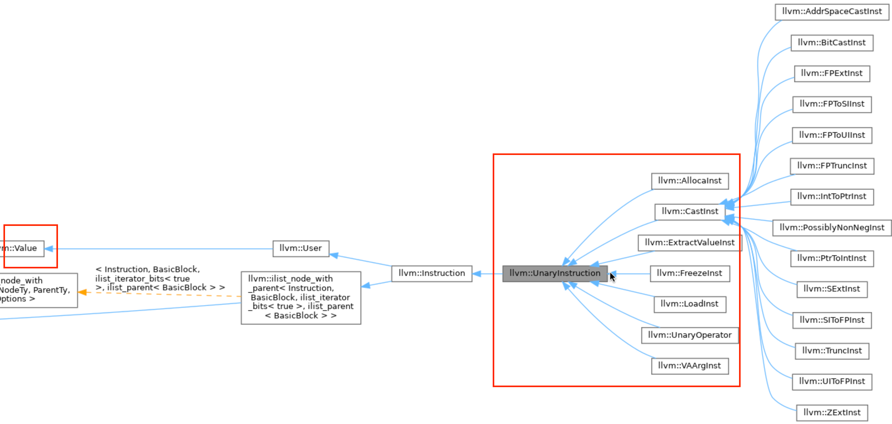

## Report
https://llvm.org/doxygen/group__LLVMCCoreValueInstructionAlloca.html
- Functions in this group only apply to instructions that map to llvm::AllocaInst instances.

### Instruction Diagram
  - https://llvm.org/doxygen/classllvm_1_1Instruction.html \
    - 일반 Instruction 바로 하위에 있는 Inst
      
    - Value의 하위에 Instruction class 존재

  - https://llvm.org/doxygen/classllvm_1_1UnaryInstruction.html
    -  하나의 피연산자(operand)만 갖는 명령어
    
    - AllocaInst와 loadInst 위치


### MemoryProfiler
 - size_t 자료형을 그냥 unsigned int로 사용하면 되지 왜 굳이 size_t로 정의를 해서 사용할까?
  - size_t 자료형은 해당 시스템(운영체제)에서 포함할 수 있는 최대 크기의 데이터를 정의하는데 있다.
  - size_t 크기는 32비트 운영체제(OS)에서는 32bit(=4byte)의 부호없는 자료형이 되고 64비트 운영체제(OS)에서는 64bit(=8byte)의 부호없는 자료형으로 정의를 해야 한다.
  - 하지만 unsigned int는 32비트, 64비트 운영체제마다 무조건 32bit, 64bit로 정의되어 있지 않기 때문에 unsigned int를 사용할 수 없다.
    - unsigned int는 시스템의 비트 수(32비트 OS냐 64비트 OS냐)에 따라 자동으로 32비트에서 64비트로 "늘어나지 않는다." 대부분 32비트이다.
  - 이때 size_t는 ```M.getDataLayout().getIntPtrType(Context)```로 나타낼 수 있다. <br>
    -  현재 아키텍처 컨텍스트에서 int_ptr가 몇 비트로 사이즈가 측정되는지 
    - ***DataLayout***
      - LLVM에서 DataLayout은 컴파일 대상 아키텍처(CPU 아키텍처 및 OS)의 메모리 모델에 대한 정보를 캡슐화하는 객체
        - 정수 타입의 크기 및 정렬.
        - 부동 소수점 타입의 크기 및 정렬.
        - **포인터의 크기 및 정렬.**
        - 구조체 패딩 규칙
      - DataLayout은 특정 타겟(예: x86-64 Linux, ARM 32-bit Android)에 따라 포인터가 몇 비트인지, long 타입이 몇 비트인지 등을 정확히 알려준다.
    - ***getIntPtrType(Context)***
      ~~~ c++
        IntegerType *DataLayout::getIntPtrType(LLVMContext &C,
                                       unsigned AddressSpace=0) const {
          return IntegerType::get(C, getPointerSizeInBits(AddressSpace));
        }
      ~~~
      - AddressSpace 0은 기본(Default) 또는 제네릭(Generic) 주소 공간
        - 가장 흔한 경우: C/C++ 프로그램이 일반적인 컴퓨터(데스크톱, 서버)에서 실행될 때, malloc이나 스택 할당 등으로 얻는 메모리는 모두 이 AddressSpace 0에 속한다고 간주 \

refernce: https://olivertree-cs.tistory.com/entry/sizet-%EC%9E%90%EB%A3%8C%ED%98%95-%EC%A3%BC%EC%9D%98%EC%A0%90


## `FunctionCallee`와 `CreateCall` 인자 전달

>**`FunctionCallee`에 인자(arguments)를 넣지 않는다.** `FunctionCallee`는 호출될 \함수 자체의 정보 (타입과 실제 함수 값)를 담고 있는 컨테이너일 뿐이다. \
함수를 호출할 때 전달하는 실제 인자들은 여전히 **`IRBuilder::CreateCall`의 추가 인자로 전달**해야 힌다.

```c++
CallInst *CreateCall(FunctionCallee Callee,
                     ArrayRef<Value *> Args = std::nullopt,
                     // Twine은 LLVM에서 문자열을 효율적으로 처리하기 위한 클래스
                     // LLVM IR 명령어(ex: CallInst)에 할당될 이름을 추가
                     const Twine &Name = "",
                     // 부동 소수점 계산은 수학적으로 정확해야 하는 경우가 있지만, 성능을 위해 약간의 오차를 허용하여 최적화할 수 있는 경우도 있다. 
                     // FPMathTag는 이러한 최적화 레벨을 LLVM에게 힌트 주는 메커니즘을 제공gksek.
                     MDNode *FPMathTag = nullptr,
                     // 일반적인 함수 호출에서는 거의 사용되지 않으며, 특정 언어 런타임 지원이나 고급 최적화 패스에서 드물게 등장
                     // 필요 시 공부
                     ArrayRef<OperandBundleDef> Bundles = std::nullopt);
```

> 여기서 중요한 부분은 두 번째 인자인 `ArrayRef<Value *> Args`이다.
이 `Args` 배열에 실제 함수 호출에 사용될 **`Value`**들을 넣어야 한다.


## Each Step Command for Execution
0. bc 파일 만들기
  ~~~
  clang -O3 -c -emit-llvm --sysroot=`xcrun --show-sdk-path` main.c -o main.bc
  clang -O0 -c -emit-llvm main.c -o main.bc
  opt --load-pass-plugin MemoryProfilerPass.so --passes=memory-profiler main.bc -o main.opt.bc
  ~~~
1. compile
  ~~~
      clang++ -c -fpic MemoryProfilerPass.cpp -o MemoryProfilerPass.o -std=c++17 --sysroot=`xcrun --show-sdk-path` -stdlib=libc++ `llvm-config --cppflags`

      clang++ MemoryProfilerPass.cpp -c -fpic -o MemoryProfilerPass.o `llvm-config --cppflags` -stdlib=libc++
      # -stdlib=libc++,  `llvm-config --cppflags`  중요 
  ~~~
  ~~~
      clang++ -fpic -c MemoryProfiler.cpp -o MemoryProfiler.o -std=c++17 --sysroot=`xcrun --show-sdk-path` -stdlib=libc++ `llvm-config --cppflags`

      clang++ MemoryProfiler.cpp -c -fpic -o MemoryProfiler.o -fPIC `llvm-config --cppflags`
  ~~~

2. making shared library for dynamic linking
  ~~~
      clang++ -shared MemoryProfiler.o -o libMemoryProfiler.so \
      --sysroot=$(xcrun --show-sdk-path) \
      $(llvm-config --ldflags --libs) \
      -lc++abi -lunwind
  ~~~
  ~~~
      clang++ -shared MemoryProfilerPass.o -o MemoryProfilerPass.so \
      --sysroot=$(xcrun --show-sdk-path) \
      $(llvm-config --ldflags --libs) \
      -lc++abi -lunwind

      clang++ -shared MemoryProfilerPass.o -o MemoryProfilerPass.so 
  ~~~

3. linking
    - mac <br>
    ```clang++ main.opt.bc -o main.exe -L. -lMemoryProfiler --sysroot=`xcrun --show-sdk-path` -stdlib=libc++```
    - linux <br>
    ``` clang++ main.opt.bc -o main.exe -lMemoryProfiler -L .```

## Error

1. 
  ~~~ bash
      %1 = alloca i32, align 4
      i8  call void @traceAllocStack(ptr %1, i64 32)
      Call parameter type does not match function signature!
  ~~~
  - sol \
    ```Type::getInt8Ty(Context)``` -> ```llvm::PointerType::get(Type::getInt8Ty(Context), 0)```
    + ```• Type::getInt8PtrTy(Context)``` -> 사라짐, 따라서 int8을 pointer타입으로 바꿔주는 코드로 짜야해

2. 
  ~~~ bash
      %1 = alloca i32, align 4
      call void @traceAllocStack(ptr %1, i64 32)
    Instruction does not dominate all uses!
      %2 = alloca ptr, align 8
      call void @traceAllocStack(ptr %2, i64 64)
    Instruction does not dominate all uses!
      %3 = alloca i32, align 4
      call void @traceAllocStack(ptr %3, i64 32)
    Instruction does not dominate all uses!
      %4 = alloca i32, align 4
      call void @traceAllocStack(ptr %4, i64 32)
    Instruction does not dominate all uses!
      %5 = call noalias ptr @malloc(i64 noundef 8) #4
      call void @traceMalloc(ptr %5, i64 8)
    LLVM ERROR: Broken module found, compilation aborted!
  ~~~
  - sol \
    ```IRBuilder<> MallocBuilder(call);``` -> ```IRBuilder<> MallocBuilder(call->getNextNonDebugInstruction());```
    - IRbuilder<>(Inst*)은 inst앞에 삽입
    - IRBuilder<>를 callInst로 초기화하면, traceMalloc 호출이 malloc 호출보다 앞에 생성되어 malloc의 결과를 사용할 수 없으므로 "Instruction does not dominate all uses!" 오류가 발생
    - call->getNextNonDebugInstruction()을 사용하여 malloc 호출 뒤에 삽입 지점을 설 

3. 
  ~~~ c++
    Value* allocatedPtr = MallocBuilder.CreatePointerCast(call, llvm::PointerType::get(Type::getInt8Ty(Context), 0));
    Value* allocatedSize = call->getArgOperand(0); 
    MallocBuilder.CreateCall(traceMalloc, {allocatedPtr, allocatedSize});
  ~~~
  - call 명령어 자체는 특정 함수 호출을 나타내는 LLVM IR Instruction 객체이다.
  - 하지만 call 객체가 Value*로 사용될 때 (CreatePointerCast의 첫 번째 인자로 사용될 때), **해당 call 명령어가 생산하는 "결과 값" (malloc의 반환 값)**을 의미한다.
  - malloc 함수의 반환 값은  **할당된 힙 메모리의 시작 주소(포인터)**다.
  - CreatePointerCast는 이 이미 주소인 값의 LLVM IR 상의 타입을 변경하거나 확인하는 역할을 한다. 따라서 allocatedPtr은 여전히 그 주소 값을 유지한다. 
  ---
  - call->getArgOperand(0) 는 call의 첫번째 인자인데 malloc의 1번째 arg는 size_t니까
  ``` void* malloc(size_t) ```

4.
  ~~~ c++
    Value* allocatedPtr = AllocaBuilder.CreatePointerCast(alloc->getAddressSpace(), llvm::PointerType::get(Type::getInt8Ty(Context), 0));
    alloc->getAddressSpace(): int
  ~~~
  ~~~ c++
      CastInst * CastInst::CreatePointerCast	(Value * 	S,
      Type * 	Ty,
      const Twine & 	Name = "",
      InsertPosition 	InsertBefore = nullptr 
      )	
  ~~~
  - Value가 들어갈 자리에 unsigned int가 들어가서 오류

5. 
  ~~~ c++
    TypeSize size = Layout.getTypeSizeInBits(alloc->getAllocatedType());
    Value* allocatedPtr = AllocaBuilder.CreatePointerCast(alloc, llvm::PointerType::get(Type::getInt8Ty(Context), 0));
    Value* allocatedSize = ConstantInt::get(M.getDataLayout().getIntPtrType(Context), size/8);
    AllocaBuilder.CreateCall(traceAllocStack, {allocatedPtr, allocatedSize});
  ~~~
  - alloca 명령어는 스택에 할당된 메모리 블록의 시작 주소를 나타내는 포인터를 반환
  - CreateCall의 args Array는 Value*이 들어가야 함, 
6. 
  ~~~ c++
    TypeSize size = Layout.getTypeSizeInBits(load->getPointerOperandType());
    Value* loadedPtr = LoadBuilder.CreatePointerCast(load->getPointerOperand(), llvm::PointerType::get(Type::getInt8Ty(Context), 0));
    Value* loadedSize = ConstantInt::get(M.getDataLayout().getIntPtrType(Context), size/8);
  ~~~
  - Load시 0번째 피연산자 반환: load->getPointerOperand()
    -  load i32, ptr %3, align 4
  - store i32 %10, ptr %14, align 4
    - 따라서 store->getPointerOperand()는 1번째 operand반환
  - getIntPtrType: https://llvm.org/doxygen/classllvm_1_1DataLayout.html
  - static Constant * 	get (Type *Ty, const APInt/uint64_t &V)
    - TypeSize가 연산이 돼서 APInt(functional replacement for common case unsigned integer type like "unsigned", "unsigned long" or "uint64_t) 

## Result
~~~ bash
  ./main.exe 
  [Memory Allocation(Stack)] Addr: 0xfffff1accc7c Size: 4 -> ???
  [Memory Allocation(Stack)] Addr: 0xfffff1accc70 Size: 8 -> mat
  [Memory Allocation(Stack)] Addr: 0xfffff1accc6c Size: 4 -> i (1번째 for문)
  [Memory Allocation(Stack)] Addr: 0xfffff1accc68 Size: 4 -> i (2번째 for문)
  [Store] Addr: 0xfffff1accc7c Size: 8 -> ???

  [Memory Allocation(Heap)] Addr: 0xaaab0e7842c0 Size: 8 -> mat malloc시

  [Store] Addr: 0xfffff1accc70 Size: 8 
  [Store] Addr: 0xfffff1accc6c Size: -> int i = 0 
  [Load] Addr: 0xfffff1accc6c Size: 8 -> i < malloc_size에서 i 사용
  [Load] Addr: 0xfffff1accc70 Size: 8 -> mat[i] = rand()에서 mat load
  [Load] Addr: 0xfffff1accc6c Size: 8 -> mat[i] = rand()에서 i load
  [Store] Addr: 0xaaab0e7842c0 Size: 8 -> mat[i]에 값 저장
  [Load] Addr: 0xfffff1accc6c Size: 8 -> i 값 load (i++)
  [Store] Addr: 0xfffff1accc6c Size: 8 -> i++한 새 i값 i에 저장

  [Load] Addr: 0xfffff1accc6c Size: 8 -> i < malloc_size에서 i 사용
  [Load] Addr: 0xfffff1accc70 Size: 8 -> mat[i] = rand()에서 mat load
  [Load] Addr: 0xfffff1accc6c Size: 8 -> mat[i] = rand()에서 i load
  [Store] Addr: 0xaaab0e7842c4 Size: 8 -> mat[i]에 값 저장
  [Load] Addr: 0xfffff1accc6c Size: 8
  [Store] Addr: 0xfffff1accc6c Size: 8

  [Load] Addr: 0xfffff1accc6c Size: 8
  [Load] Addr: 0xfffff1accc70 Size: 8
  [Load] Addr: 0xfffff1accc6c Size: 8
  [Store] Addr: 0xaaab0e7842c8 Size: 8
  [Load] Addr: 0xfffff1accc6c Size: 8
  [Store] Addr: 0xfffff1accc6c Size: 8
  [Load] Addr: 0xfffff1accc6c Size: 8
  [Load] Addr: 0xfffff1accc70 Size: 8
  [Load] Addr: 0xfffff1accc6c Size: 8
  [Store] Addr: 0xaaab0e7842cc Size: 8
  [Load] Addr: 0xfffff1accc6c Size: 8
  [Store] Addr: 0xfffff1accc6c Size: 8
  [Load] Addr: 0xfffff1accc6c Size: 8
  [Load] Addr: 0xfffff1accc70 Size: 8
  [Load] Addr: 0xfffff1accc6c Size: 8
  [Store] Addr: 0xaaab0e7842d0 Size: 8
  [Load] Addr: 0xfffff1accc6c Size: 8
  [Store] Addr: 0xfffff1accc6c Size: 8
  [Load] Addr: 0xfffff1accc6c Size: 8
  [Load] Addr: 0xfffff1accc70 Size: 8
  [Load] Addr: 0xfffff1accc6c Size: 8
  [Store] Addr: 0xaaab0e7842d4 Size: 8
  [Load] Addr: 0xfffff1accc6c Size: 8
  [Store] Addr: 0xfffff1accc6c Size: 8
  [Load] Addr: 0xfffff1accc6c Size: 8
  [Load] Addr: 0xfffff1accc70 Size: 8
  [Load] Addr: 0xfffff1accc6c Size: 8
  [Store] Addr: 0xaaab0e7842d8 Size: 8
  [Load] Addr: 0xfffff1accc6c Size: 8
  [Store] Addr: 0xfffff1accc6c Size: 8
  [Load] Addr: 0xfffff1accc6c Size: 8
  [Load] Addr: 0xfffff1accc70 Size: 8
  [Load] Addr: 0xfffff1accc6c Size: 8
  [Store] Addr: 0xaaab0e7842dc Size: 8
  [Load] Addr: 0xfffff1accc6c Size: 8
  [Store] Addr: 0xfffff1accc6c Size: 8
  [Load] Addr: 0xfffff1accc6c Size: 8 -> i <Malloc_size

  // new for
  [Store] Addr: 0xfffff1accc68 Size: 8 -> new i
  [Load] Addr: 0xfffff1accc68 Size: 8
  [Load] Addr: 0xfffff1accc70 Size: 8 -> mat load
  [Load] Addr: 0xfffff1accc68 Size: 8
  0xaaab0e7842c0 
  [Load] Addr: 0xfffff1accc68 Size: 8
  [Store] Addr: 0xfffff1accc68 Size: 8
  [Load] Addr: 0xfffff1accc68 Size: 8
  [Load] Addr: 0xfffff1accc70 Size: 8
  [Load] Addr: 0xfffff1accc68 Size: 8
  0xaaab0e7842c4
  [Load] Addr: 0xfffff1accc68 Size: 8
  [Store] Addr: 0xfffff1accc68 Size: 8
  [Load] Addr: 0xfffff1accc68 Size: 8
  [Load] Addr: 0xfffff1accc70 Size: 8
  [Load] Addr: 0xfffff1accc68 Size: 8
  0xaaab0e7842c8
  [Load] Addr: 0xfffff1accc68 Size: 8
  [Store] Addr: 0xfffff1accc68 Size: 8
  [Load] Addr: 0xfffff1accc68 Size: 8
  [Load] Addr: 0xfffff1accc70 Size: 8
  [Load] Addr: 0xfffff1accc68 Size: 8
  0xaaab0e7842cc
  [Load] Addr: 0xfffff1accc68 Size: 8
  [Store] Addr: 0xfffff1accc68 Size: 8
  [Load] Addr: 0xfffff1accc68 Size: 8
  [Load] Addr: 0xfffff1accc70 Size: 8
  [Load] Addr: 0xfffff1accc68 Size: 8
  0xaaab0e7842d0
  [Load] Addr: 0xfffff1accc68 Size: 8
  [Store] Addr: 0xfffff1accc68 Size: 8
  [Load] Addr: 0xfffff1accc68 Size: 8
  [Load] Addr: 0xfffff1accc70 Size: 8
  [Load] Addr: 0xfffff1accc68 Size: 8
  0xaaab0e7842d4
  [Load] Addr: 0xfffff1accc68 Size: 8
  [Store] Addr: 0xfffff1accc68 Size: 8
  [Load] Addr: 0xfffff1accc68 Size: 8
  [Load] Addr: 0xfffff1accc70 Size: 8
  [Load] Addr: 0xfffff1accc68 Size: 8
  0xaaab0e7842d8
  [Load] Addr: 0xfffff1accc68 Size: 8
  [Store] Addr: 0xfffff1accc68 Size: 8
  [Load] Addr: 0xfffff1accc68 Size: 8
  [Load] Addr: 0xfffff1accc70 Size: 8
  [Load] Addr: 0xfffff1accc68 Size: 8
  0xaaab0e7842dc
  [Load] Addr: 0xfffff1accc68 Size: 8
  [Store] Addr: 0xfffff1accc68 Size: 8
  [Load] Addr: 0xfffff1accc68 Size: 8
~~~


## ETC
- deprecated
  - IR builder로 toyproject에서는 CreateCall 이용함
  


## Question
- result \
  1. 
    ~~~
      [Memory Allocation(Stack)] Addr: 0xfffff1accc7c Size: 4 -> ???

      ---
      %1 = alloca i32, align 4
      call void @traceMalloc(ptr %1, i64 32)
      store i32 0, ptr %1, align 4
      call void @traceStore(ptr %1, i64 8)

    ~~~
    - "%1사용 부분" -> 0만 저장하고 하는 거 안 보임 -> return 부분인가??
   
  2. 
    ~~~
      [Memory Allocation(Stack)] Addr: 0xfffff1accc7c Size: 4 -> ???
      [Memory Allocation(Stack)] Addr: 0xfffff1accc70 Size: 8 -> mat
    ~~~
    - 12byte나 차지한 이유
  3. mat이 heap, stack에 모두 저장되는 이유..? 
  4.  You need to cast i32* to i8* for load and store -> why? \
      - FunctionType에서 int8*로 선언해놔서?? \ 
      ```Value* loadedPtr = LoadBuilder.CreatePointerCast(load->getPointerOperand(), llvm::PointerType::get(Type::getInt8Ty(Context), 0));```
  5. TypeSize가 어떻게 APINT자리에??